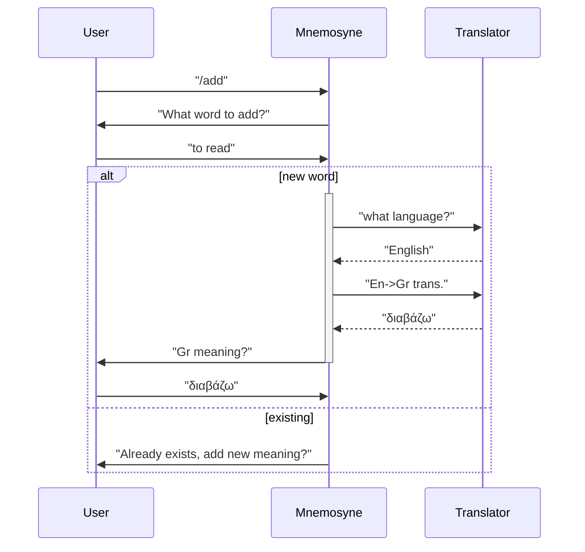

# Add word

```mermaid
sequenceDiagram
  User->>Mnemosyne: "/add"
  Mnemosyne->>User: "What word to add?"
  User->>Mnemosyne: "to read"
  alt new word
    activate Mnemosyne;
    Mnemosyne->>Translator: "what language?"
    Translator-->>Mnemosyne: "English"
    Mnemosyne->>Translator: "En->Gr trans."
    Translator-->>Mnemosyne: "διαβάζω"
    Mnemosyne->>User: "Gr meaning?"
    deactivate Mnemosyne;
    User->>Mnemosyne: "διαβάζω"
  else existing
    Mnemosyne->>User: "Already exists, add new meaning?"
  end
```
