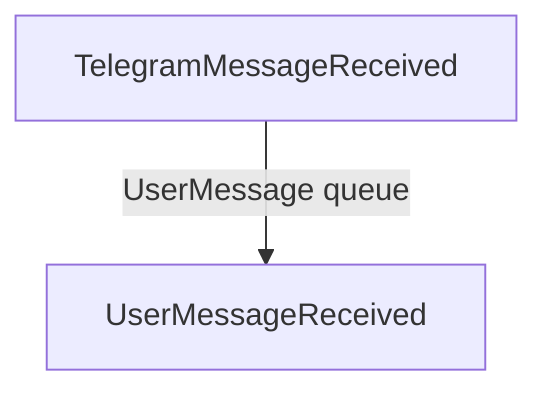

## UserMessage queue

The user message queue takes messages of the following format:

```json
{
    userId: "...", # internal user id, uniquely identifying the user
    userName: "...", # name with which to address the user
    text: "...", # text that the user sent

    # telegram specific
    chatId: "...", # chat id with which to respond to the user
}
```