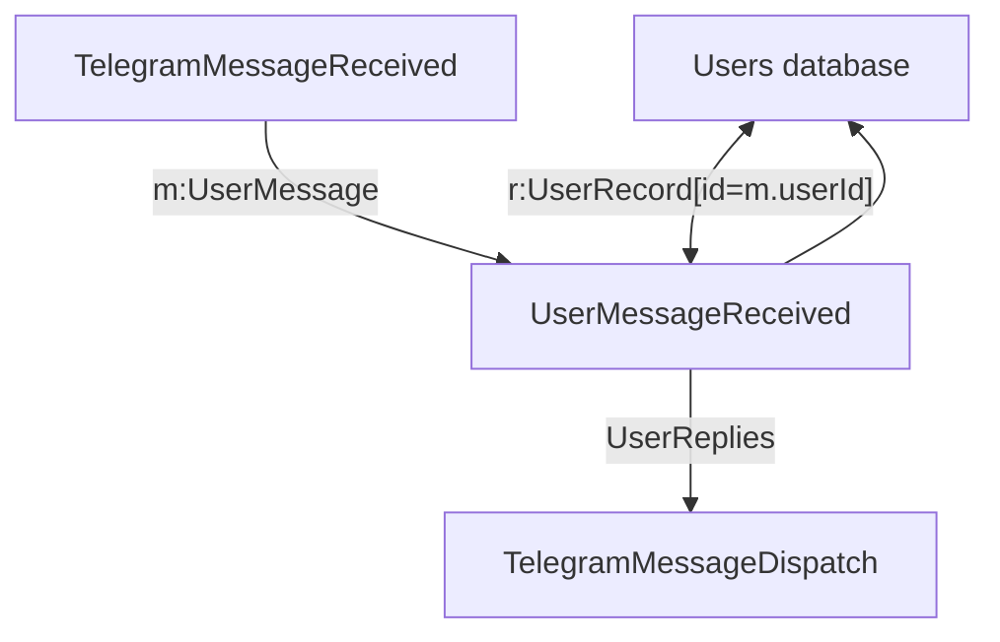

## Message received

To start, when a telegram message is received, it is encoded into the queue and
fired off to the `UserMessageReceived` function to be dispatched. That function
also looks it up in the database. From there, it can be dispatched to
various different functions, depending on the text of the message and
the current state.



## UserMessage queue

The user message queue takes messages of the following format:

```json
{
    userId: "...", # internal user id, uniquely identifying the user
    userName: "...", # name with which to address the user
    text: "...", # text that the user sent

    # telegram specific
    chatId: "...", # chat id with which to respond to the user
}
```