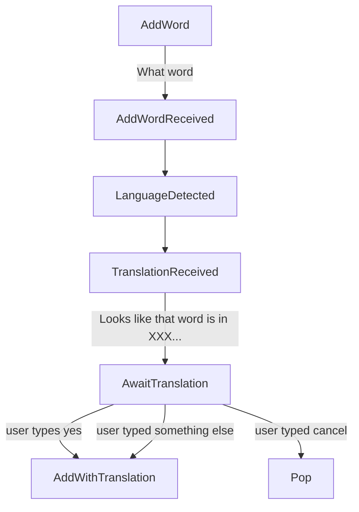

# User database

Keyed by a globally unique user id, contains a single record, which has the following structure:

```json
{
    "id": "...", # Global user id
    "name": "...", # Name by which we call the user
    "states": "...", # Name of the top-most state
    "stateData": "...", # Data specific to the current state
    "chat_id": NNN, # Telegram id of the chat with the user
}
```

Can be partitioned on `id`, as there are never any cross record modifications.

This user record is taken as input to most of the functions and also give as output. For now we don't worry about atomicity and so forth, although it could well be that a better choice would be to use a Durable Entity for this.

## User states

## Adding a word

Example flow 1:

```
User> /add
Mnemosyne> What word do you want to add?
User> to read
Mnemosyne> Looks like that word is in English and the Greek equivalent is "διαβάζω". If you agree, type "yes", otherwise type the Greek meaning you prefer.
User> Yes
Mnemosyne> Added: διαβάζω = to read
```

Example flow 2:

```
User> /add
Mnemosyne> What word do you want to add?
User> διαβάζω
Mnemosyne> Looks like that word is in Greek and the English equivalent is "to read". If you agree, type "yes", otherwise type the Greek meaning you prefer.
User> I read
Mnemosyne> Added: διαβάζω = I read
```

States

